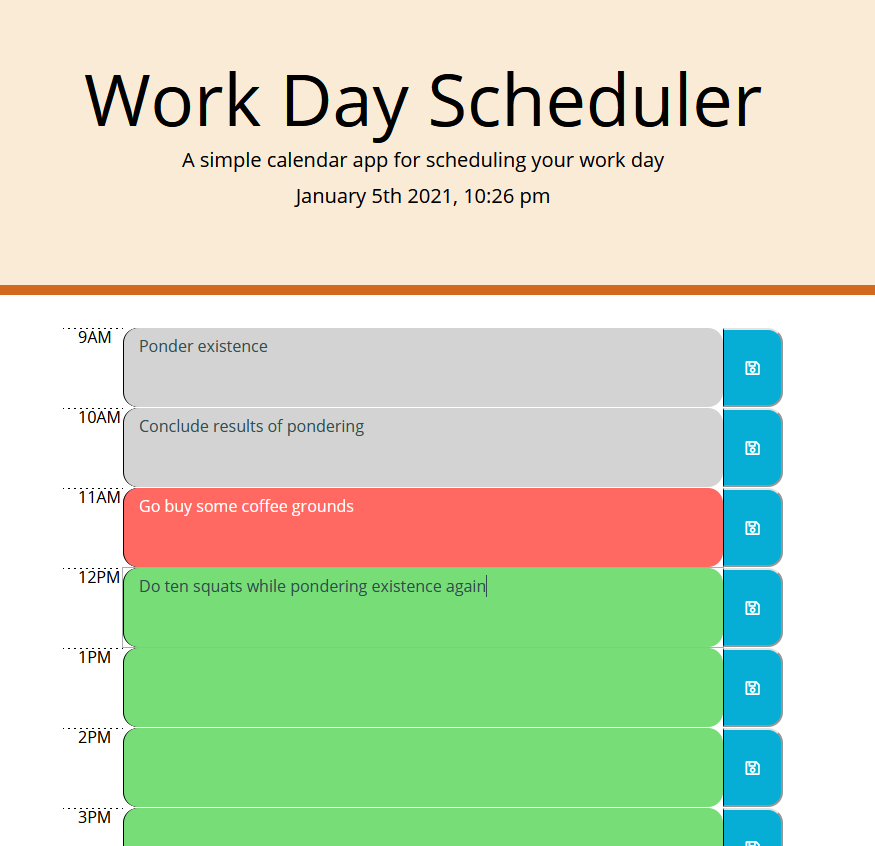

# Daily Planner

## Description
Hello! This deployed webpage is a daily planner that also displays the current date and time at the moment when the page was opened. Each central box has a text field that the user can enter text into after clicking that field. When the user clicks the blue save button on the right side of the text box, their entry (or lack thereof) is saved to local storage, and will be displayed again if the page is refreshed. Central boxes are colored grey when their corresponding hour has passed, red when their hour matches the current hour, and green when their hour has not yet passed. These features allow the user to create a simple daily schedule that displays the current time and uses color-coded fields to further visualize the hour of the day.


## Table of Contents
* [Technologies Used](#technologies-used)
* [How to Access](#how-to-access)
* [What I Did](#what-i-did)
* [Code Snippets](#code-snippets)
* [Screenshots](#screenshots)
* [Acknowledgments](#acknowledgments*)
* [Who I Am](#who-i-am)

---

## Technologies Used
* [HTML](https://www.w3schools.com/html/) to structure the "skeleton" of the webpage and its elements.
* [CSS](https://www.w3schools.com/css/) for visual styling to make that HTML much prettier.
* [Javascript](https://www.javascript.com/) to develop the algorithms included in this web application.
* [jQuery](https://api.jquery.com/) for shorthand Javascript commands included in the code.
* [Bootstrap](https://getbootstrap.com/) for shorthand CSS styling within the HTML.
* [Git](https://git-scm.com/) for distributed version control, tracking changes over time and making them visible to collaborators.
* [Github](https://github.com/) for version control in the cloud, saving my changes and presenting them clearly to myself and others.

## How to Access
* [Click here](https://prophetrand.github.io/my-day-planner/) to view the deployed Day Planner.

---

## What I Did
I used jQuery in combination with the Moment.js API to populate the contents of the &lt;body&gt;. The majority of the app's functionality exists within a for loop that creates every element in the body based on an array of hourly time slots, from 9AM to 5PM. Within the same for loop, local storage is checked to evaluate if saved values already exist for each text field, and populates those fields with the appropriate value if that condition is met. Finally, the for loop assigns the class of "past", "present", or "future" to each text field by comparing their "data-time" value to the current time with Moment.js methods. The boxes are colored based on rules provided in style.css. I defined various element styles throughout the page with both Bootstrap and style.css.

I used the methods localStorage.setItem() and localStorage.getItem() to save and access values in local storage. This allows the user's entered schedule items to persist when the page is refreshed as long as the user clicks the save button to the right of the text field. 

## Code Snippets 
The current hour (in 24-hour format) is compared to the data-time label for each row. Depending on the condition met, the class of past, present, or future is added to the textArea. In the CSS, these classes have specific rules for text and background colors.

The event listener $(".saveBtn").on("click", function(){...}) triggers when any element with the class "saveBtn" is clicked on, and corresponds to every save button.

The sibling of the clicked button with the class of "time-block" is accessed, and the text contained there is stored in the variable saveThisText.

A key is created using the "data-time" value of the parent row, and is stored in the variable contentKey.

The key of contentKey with the value of saveThisText is saved to local storage.

```
if (parseInt(moment().format('H')) > rowBox.attr("data-time")){
    textArea.addClass("past");
} else if (parseInt(moment().format('H')) < rowBox.attr("data-time")){
    textArea.addClass("future");
} else {
    textArea.addClass("present");
}

$(".saveBtn").on("click", function(){
    var saveThisText = $(this).siblings(".time-block").val();
    var contentKey = "content-" + $(this).parents().attr("data-time");
    localStorage.setItem(contentKey, saveThisText);
})
```

## Screenshots
The image below displays the appearance of the web app on a medium-sized screen.
Rows whose time has passed are assigned the class of "past" and given a grey color in the CSS. The row with the current hour is assigned the class of "present" and appears red, while rows with the class "future" appear green.

For the purpose of displaying the colors in this image I adjusted the time value for the rows to the hypothetical value of 11AM, which does not match the actual time of the screenshot displayed in the header.



---

## Acknowledgments
* [W3Schools](https://www.w3schools.com/) has been my go-to for descriptive tutorials on HTML, CSS, and Javascript syntax and best practices. I am eternally grateful for their massive store of documentation.
* [MDN Web Docs](https://developer.mozilla.org/en-US/) is another resource for documentation on HTML, CSS, and Javascript that I find myself using more and more often as I work through deeper Javascript.
* [Moment.js](https://momentjs.com/) is a free API that allows (and simplifies) the use of dates and times in Javascript. Even though this service is no longer supported by its developers, I am thankful for its straightforward usage and succinct structure.
* UC Berkeley Coding Bootcamp provided the initial HTML to begin developing from.


## Who I Am
My name is Rand Hale, and I am an aspiring programmer/web developer based in California.

* [LinkedIn](https://www.linkedin.com/in/rand-hale-83ba389b/)
* [Portfolio](https://prophetrand.github.io/my-responsive-portfolio/)